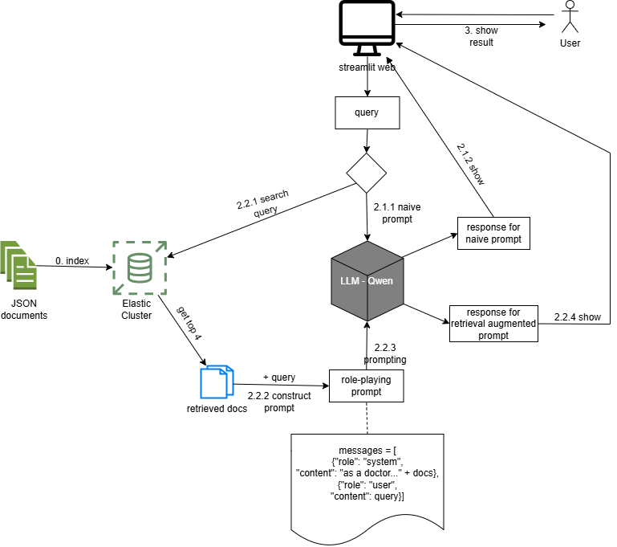

# VIETNAMESE HEALTH NEWS RETRIEVALS
<br>

## 0 . Install requirements:
```bash
pip install -r requirements.txt
```

## 1. Serving Qwen API with vLLM, Openai API and ngrok
- Open and run flowing the Colab notebook: [vllm-serving](https://colab.research.google.com/drive/1k7CoJ-pxoizaGVsXZfkV7SScPOnj2etY?usp=sharing)
- Remember to get the ngrok public URL at the last cell output.
- Adding the URL to the file [req2Qwen](/streamlit-app/req2Qwen.py)

## 2. Serving Elasticsearch cluster on localhost:9200
- You can use your own local elasticsearch module, or the [elasticsearch_analysis_vietnamsese](https://github.com/duydo/elasticsearch-analysis-vietnamese) version.
- Config Elasticsearch CLI with [Client](/elastic-client/Client.py)
- Index the documents in the [news](/news) folder to the Elasticsearch.
- Some higher approach with embedded vector and vector search in [Index_vector](/elastic-client/Index_vector.py), [Adding_vector](/elastic-client/Adding_vector.py) and [Colab-Embedding](/word-embedding/Project1_BGE_embedding.ipynb). Please read the documentation for more information.
- There are also evaluations on the indexing-process and lexicalSearch vs vectorSearch. See [evaluation](https://docs.google.com/spreadsheets/d/1p54iJwKeWRUDo0du-JlOuecqGi1L0vXpZ1-d-rgTrDU/edit?usp=sharing).

## 3. Run the Streamlit App
```bash
cd streamlit-app
streamlit run App.py
```
- Logs of the latest prompt are in the [prompts_log.txt](/prompts_log.txt)

## 4. Basic flow and experiment:


<br>

<br>
